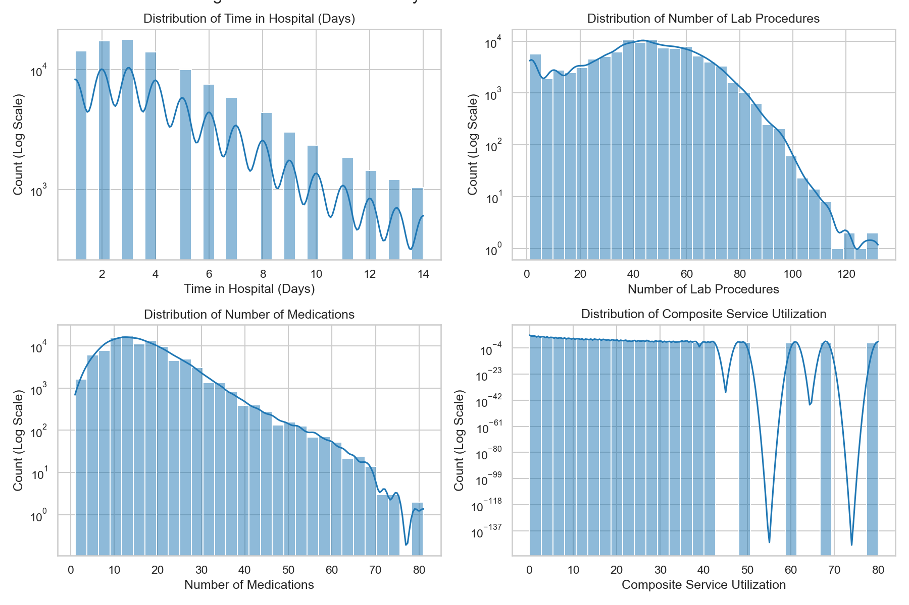
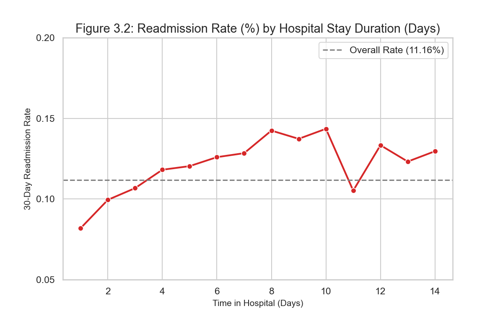
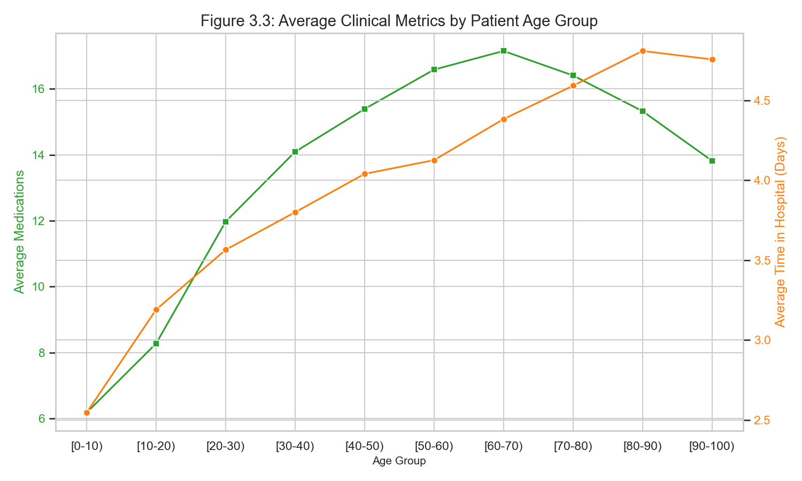
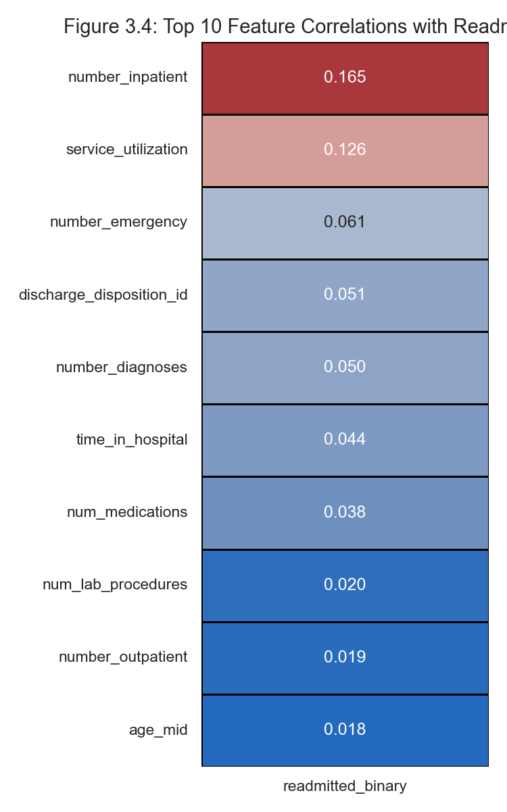
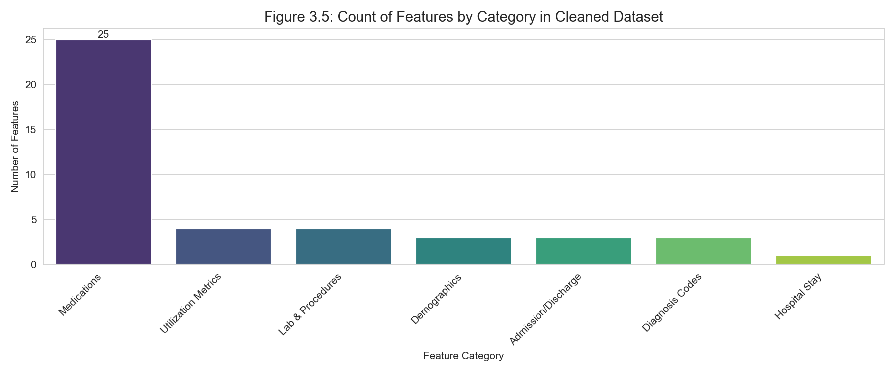
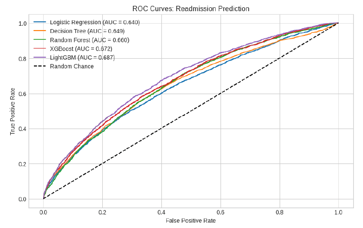
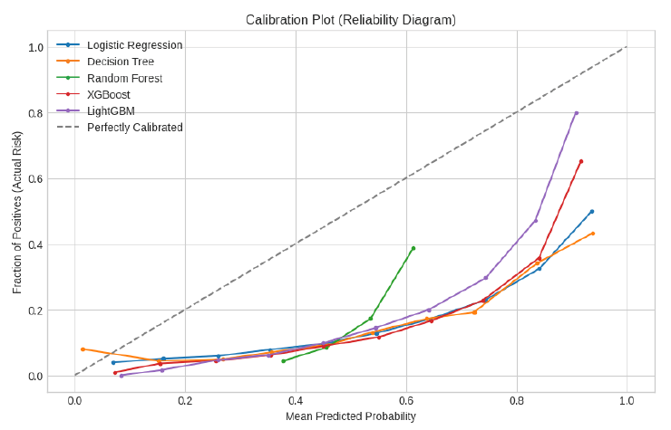
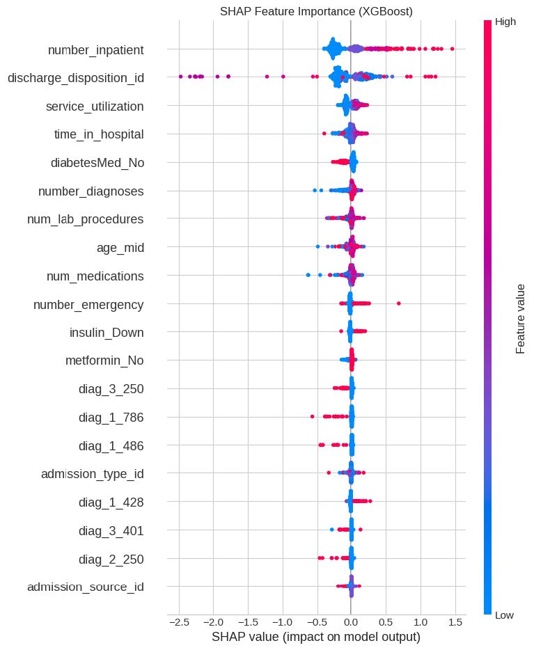

<div align="center">

# 🏥 Predicting Hospital Readmission Risk<br>Using Explainable Machine Learning on Public Health Data

[]()
[]()
[]()

</div>


## 👥 Team Members and Roles

| **Member** | **Role** | **Responsibilities**                                                                                                                                                                                                                         |
|:--|:--|:---------------------------------------------------------------------------------------------------------------------------------------------------------------------------------------------------------------------------------------------|
| **Binger** | Data Engineer / Preprocessing Lead | - Acquire and preprocess UCI Diabetes dataset.<br>- Handle missing values, encoding, and normalization.<br>- Perform exploratory data analysis (EDA) with descriptive statistics and visualizations.<br>- Prepare final presentation slides. |
| **Savina** | Modeling & Evaluation Lead | - Implement baseline models (Logistic Regression, Random Forest).<br>- Tune and train advanced models (XGBoost, LightGBM).<br>- Evaluate models using AUC, F1, and calibration plots.<br>                                                    |
| **Yansong** | Explainability & Reporting Lead | - Apply SHAP/LIME to interpret feature importance.<br>- Conduct fairness analysis across demographics.<br>- Prepare report sections, and final presentation slides.                                                                          |


## Project Overview
This project aims to predict 30-day hospital readmissions using the UCI Diabetes 130-Hospital dataset. We compare traditional ML models (Logistic Regression, Random Forest) and ensemble models (XGBoost) with explainability tools such as SHAP and LIME.


## 🗂️ Repository Structure
```
hospital-readmission-prediction/
│
├── data/
│   ├── processed/               # Binger - cleaned data  
│   └── row/                     # Binger - original datasets
│
├── docs/
│   ├── final_report/            # All - final report (Dec 4)
│   ├── presentation/            # All - slides for presentation
│   ├── proposal/                # All - proposal (Nov 13)
│
├── notebooks/
│   ├── 01_eda_proposal.ipynb    # Binger – data cleaning, EDA
│   └── 01_eda_final.ipynb       # Binger – EDA for final report
│
├── results/
│   └── figures/                 # Binger - figures for Dataset and EDA sections
│       ├── figure_3_1_distributions.png                
│       ├── figure_3_2_readmission_by_stay.png       
│       ├── figure_3_3_age_trends.png    
│       ├── figure_3_4_correlation_heatmap.png    
│       └── figure_3_5_feature_counts.png           
│
├── src/
│   └── data_preprocessing.py    # Binger - Python code for data cleaning
│
├── .gitignore
├── LICENSE
├── README.md
└── requirements.txt
```


## ⚙️ Getting Started

### 1. Clone the Repository
```bash
git clone https://github.com/bing-er/hospital-readmission-prediction.git
cd pathfinding-iptimization
```

### 2. Set Up Environment
```
python3 -m venv venv
source venv/bin/activate        # (Mac/Linux)
venv\Scripts\activate           # (Windows)
pip install -r requirements.txt
```

### 3. Run Algorithms
Run individual algorithms:
```
python src/data_preprocessing.py
```

## 📝 Team Task Assignment for Proposal

| **Member** | **Main Writing Tasks** | **Supporting Tasks** |
|:--|:--|:--|
| **Binger** | Write Sections Keywords, 3 (Dataset Description) and 5 (Team Plan and Timeline); provide dataset summary, feature overview and figures | Create, compile and format the final proposal in Overleaf.|
| **Savina** | Write Section 4 (Exploratory Data Analysis); review EDA findings for statistical validity; contribute to discussion of model preparation and expected results. | Review Abstract & Expected Results for technical clarity. |
| **Yansong** | Write Sections 0–3 (Abstract, Introduction, Related Work). | Insert SHAP/LIME visuals (concept diagrams) and ensure citation formatting. |


## 📝 Team Task Assignment for Final Paper

| **Member** | **Main Writing Tasks**                                                                                                                                     | **Supporting Tasks**                                                        |
|:--|:-----------------------------------------------------------------------------------------------------------------------------------------------------------|:----------------------------------------------------------------------------|
| **Binger** | Write Sections 3 (Dataset) and 4 (Methodology)                                                                                                             | Create, compile and format the final report in Overleaf.                    |
| **Savina** | Write Section 5 (Experiments)                                                                                                                              | Review Abstract & Expected Results for technical clarity.                   |
| **Yansong** | Write Sections Abstract, 1 (Introduction), 2 (Related Work), 6 (Results and Discussion), 7 (Conclusion), 8 (Ruture Work)                                   | Insert SHAP/LIME visuals (concept diagrams) and ensure citation formatting. |


## Project Timeline
| Phase | Dates | Deliverables |
|:--|:--|:--|
| Proposal | Nov 1 – Nov 13 | 3-page IEEE-style proposal |
| Modeling | Nov 14 – Nov 27 | Baseline & advanced models |
| Final Report | Nov 28 – Dec 4 | Full report + presentation |


## 📊 Additional Visualization


















## 📜 License

This project is developed for **educational purposes** under the **BCIT COMP 9060 – Applied Algorithm Analysis** course.  
Licensed under the [MIT License](LICENSE).
